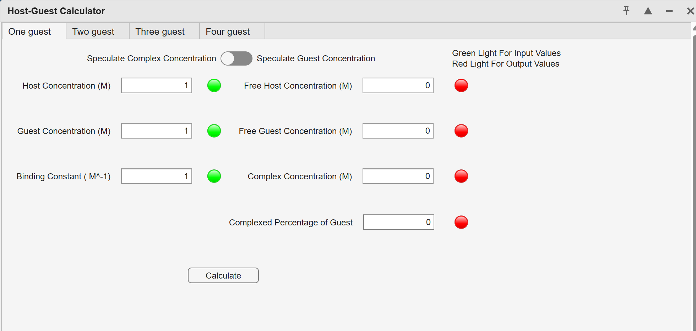
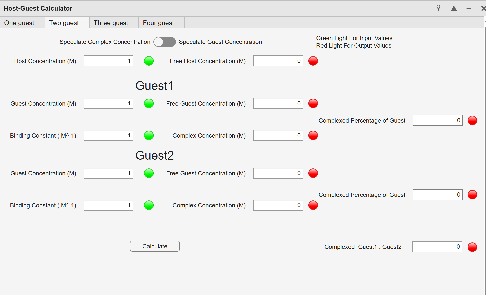
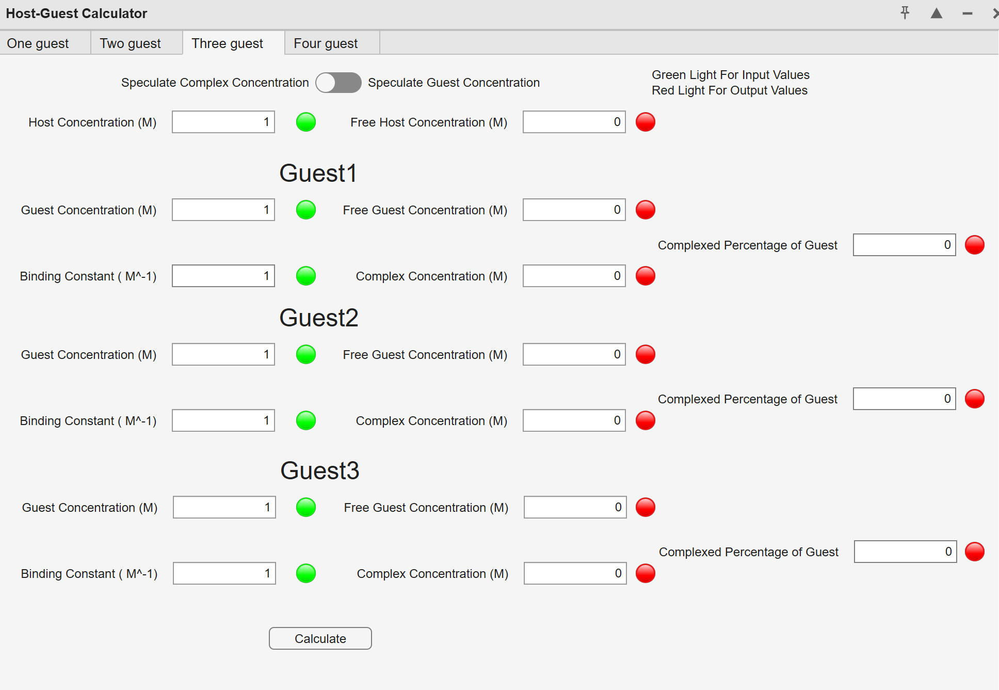
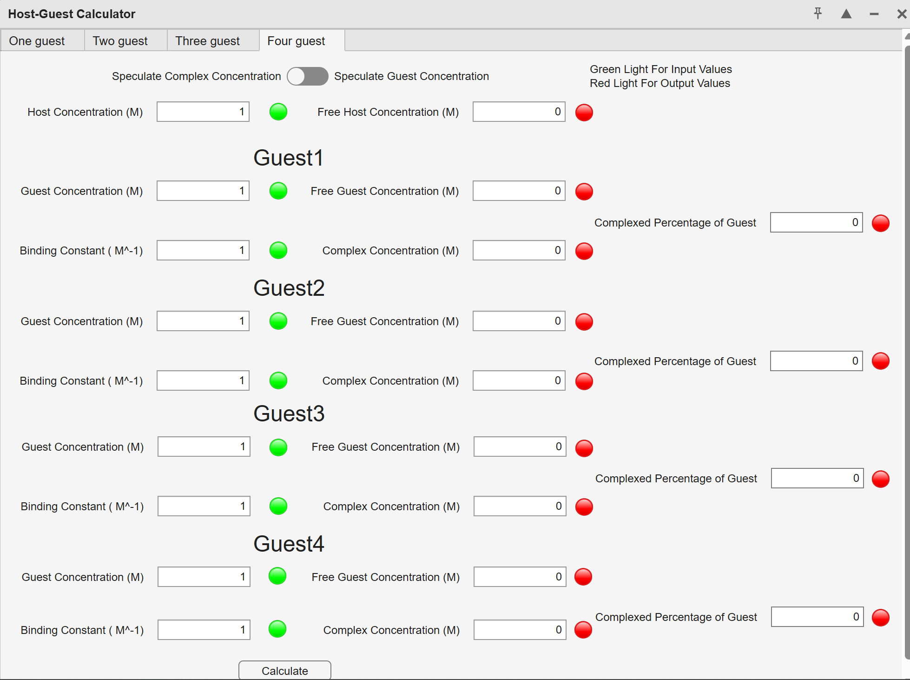

# Host-Guest Calculator (MATLAB GUI)

A MATLAB App Designer GUI for host-guest binding system analysis. The calculator supports one-, two-, three-, and four-guest systems and can calculate free host concentration, free guest concentration, complex concentration, and complexed percentage.

## Features

- Interactive MATLAB GUI built with App Designer
- Supports One / Two / Three / Four guest systems
- Calculates free host, free guest, and complex concentrations
- Calculates complexed percentage of each guest
- Includes switchable speculation mode for complex or guest concentration
- Uses green indicators for input values and red indicators for output values

## Interface Preview

### One Guest



### Two Guests



### Three Guests



### Four Guests



## File Structure

- `host_guest_4_3.mlapp` - Main MATLAB App Designer application
- `host_guest_4_3.prj` - MATLAB project file
- `oneguestfsolve.m` - Numerical solver for the one-guest calculation
- `main.m` - Entry script to launch the GUI
- `docs/images/` - Screenshots used in this README

## How to Run

Open MATLAB, set this repository as the current folder, and run:

```matlab
main
```

You can also open `host_guest_4_3.mlapp` directly in MATLAB App Designer.
